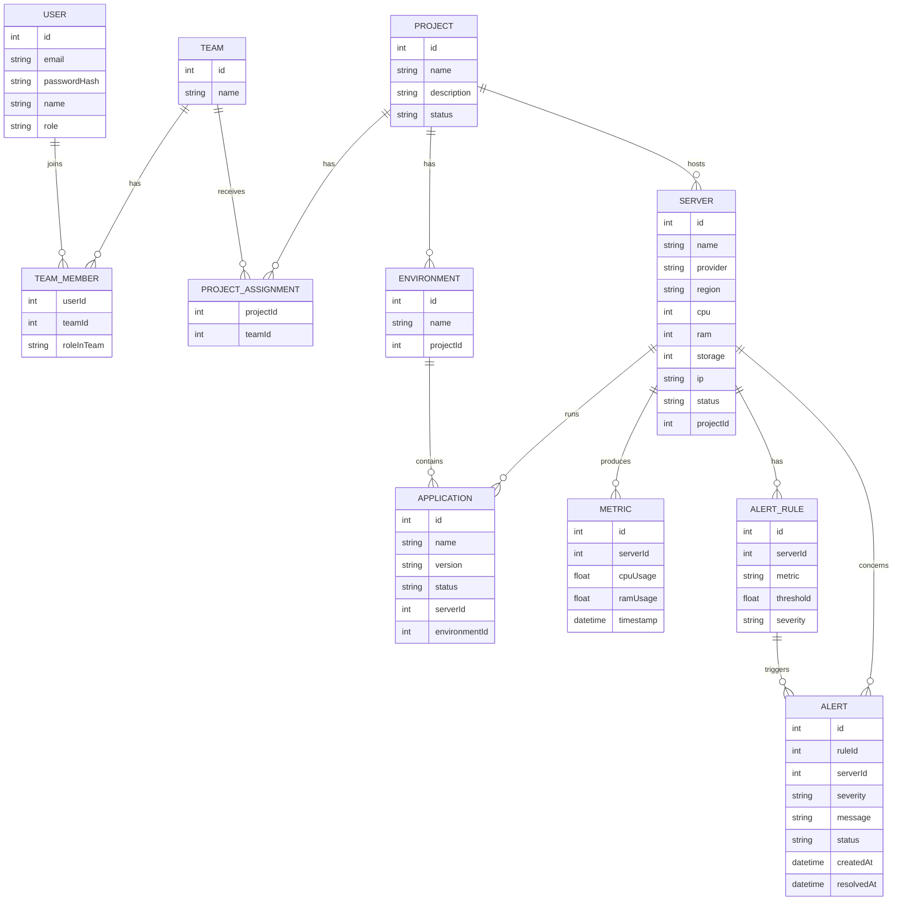

# Data Model

```mermaid
erDiagram
    USER ||--o{ TEAM_MEMBER : joins
    TEAM ||--o{ TEAM_MEMBER : has
    PROJECT ||--o{ PROJECT_ASSIGNMENT : has
    TEAM ||--o{ PROJECT_ASSIGNMENT : receives
    PROJECT ||--o{ ENVIRONMENT : has
    PROJECT ||--o{ SERVER : hosts
    SERVER ||--o{ APPLICATION : runs
    ENVIRONMENT ||--o{ APPLICATION : contains
    SERVER ||--o{ METRIC : produces
    SERVER ||--o{ ALERT_RULE : has
    ALERT_RULE ||--o{ ALERT : triggers
    SERVER ||--o{ ALERT : concerns

    USER { int id string email string passwordHash string name string role }
    PROJECT { int id string name string description string status }
    TEAM { int id string name }
    TEAM_MEMBER { int userId int teamId string roleInTeam }
    PROJECT_ASSIGNMENT { int projectId int teamId }
    ENVIRONMENT { int id string name int projectId }
    SERVER { int id string name string provider string region int cpu int ram int storage string ip string status int projectId }
    APPLICATION { int id string name string version string status int serverId int environmentId }
    METRIC { int id int serverId float cpuUsage float ramUsage datetime timestamp }
    ALERT_RULE { int id int serverId string metric float threshold string severity }
    ALERT { int id int ruleId int serverId string severity string message string status datetime createdAt datetime resolvedAt }
```