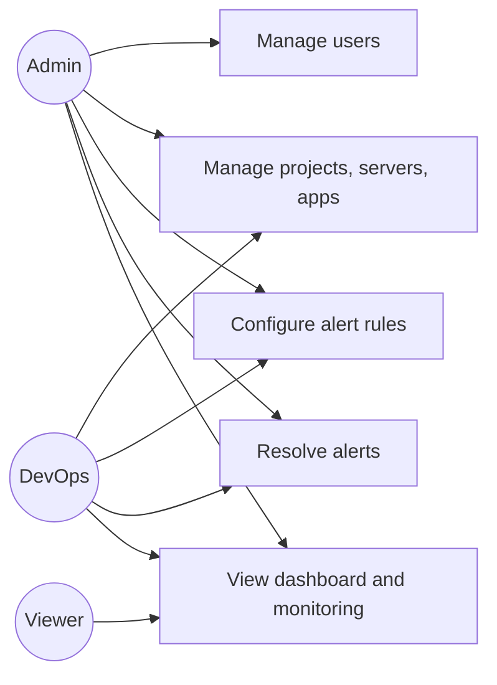

# Use Cases

```mermaid
flowchart LR
    Admin((Admin))
    DevOps((DevOps))
    Viewer((Viewer))

    Admin --> U1[Manage users]
    Admin --> U2[Manage projects, servers, apps]
    DevOps --> U2
    DevOps --> U3[Configure alert rules]
    DevOps --> U4[Resolve alerts]
    Admin --> U3
    Admin --> U4
    Admin --> U5[View dashboard and monitoring]
    DevOps --> U5
    Viewer --> U5
```